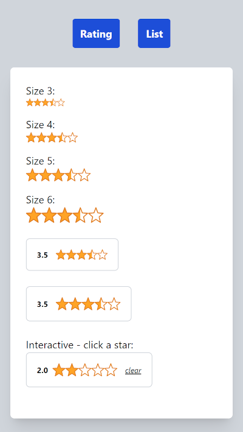
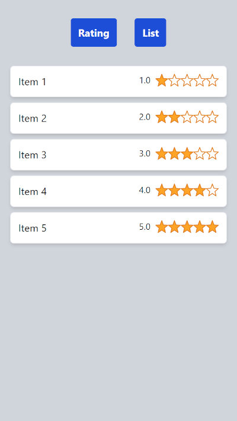

# Ratings component

Modelled after Amazon's star rating, with half star accuracy.

Start with `mix setup`, then run `mix phoenix.server` to start the web server.

Open web browser with url `localhost:4000`

**Usage:**

```elixir
# Readonly
<.rating value={3.5} max={5} class="w-4 h-4" />

# Read/write
<.rating
    id="rating"
    value={@rating}
    max={5}
    class="cursor-pointer w-5 h-5"
    phx-click="rating-click"
/>
```

 